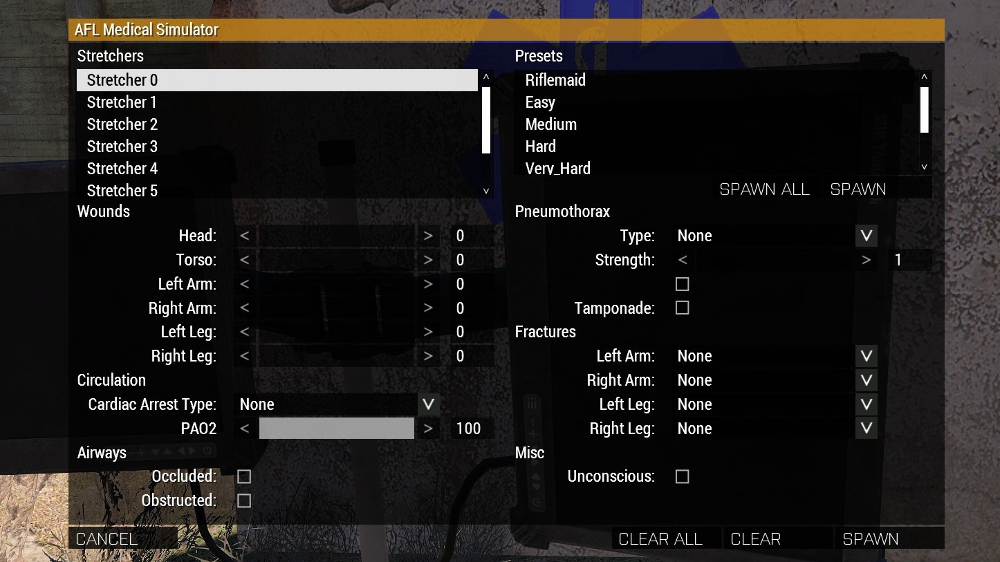

# Medical Simulator

AFL includes a medical simulator interface for practicing KAT Advanced Medical.

Includes the following functions:

- Spawn and apply medical conditions to patients:
  - Wounds.
  - Airway.
  - Cardiac arrest.
  - Pneumothorax.
  - Fractures.
- Preset system.
