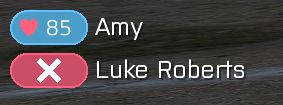

# Status Monitor

AFL adds a status monitor item that adds HUD overlay showing heart rate of units in player's group.
Includes TL variant that shows distance instead of heart rate.

To open the status monitor, open ACE Self Interact > Equipment > AFL Status Monitor.

The names of the status monitor items can be found in the
[Class Names](../../for_developers/class_names/cfgweapons.md#status-monitor) section.
