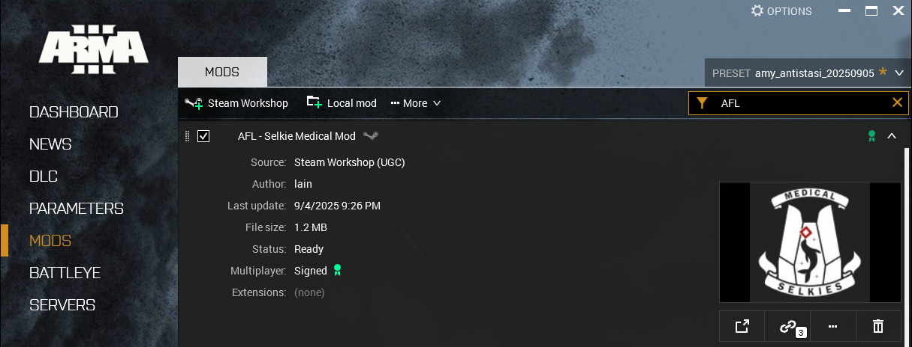

# Installation

AFL can be installed by subscribing to the mod on the Steam Workshop or by installing manually.
Subscribing in the workshop is the recommended way to install AFL.

## Dependencies

AFL requires the following dependencies to be installed either via the workshop or manually.

- CBA
  - [Steam Workshop](https://steamcommunity.com/workshop/filedetails/?id=450814997)
  - [GitHub](https://github.com/CBATeam/CBA_A3)
- ace
  - [Steam Workshop](https://steamcommunity.com/workshop/filedetails/?id=463939057)
  - [GitHub](https://github.com/acemod/ACE3)
- KAT - Advanced Medical
  - [Steam Workshop](https://steamcommunity.com/workshop/filedetails/?id=2020940806)
  - [GitHub](https://github.com/KAT-Advanced-Medical/KAM)
- O&T Expansion Eden (Firing Range Only)
  - [Steam Workshop](https://steamcommunity.com/workshop/filedetails/?id=1923321700)

## Steam Workshop

AFL can be downloaded via the Steam Workshop or from GitHub. Downloading from the Steam Workshop is the recommended way.

### Subscribing

Navigate to the [AFL Workshop Page](https://steamcommunity.com/sharedfiles/filedetails/?id=3513989482)
and subscribe to the mod.

![Image that shows Steam Workshop subscribe button. On the left, The description says "Subscribe to download // AFL -
Selkie Medical Mod. On the right, there is a green button with a checkmark that says "Subscribed".]
(../images/subscribe.png "Subscribe to AFL" =600x center)

Once subscribed to, the mod will begin downloading automatically.

### Updating

Steam Workshop mods are managed by the Steam client and should update automatically.

```admonish note
Sometimes, Steam Workshop mods fail to update automatically. If so, force the mod to update by going to the "Mods" category
in the Arma 3 launcher, expanding the "AFL - Selkie Medical Mod" entry, opening the "..." menu,
and clicking on the "Verify" option.


```

## GitHub

If you wish to use a specific version of AFL (i.e. do not wish to have automatic updates) or you do not want to use
the Steam Workshop for managing your mods, you can download and install AFL manually on GitHub.

### Downloading

Each AFL release can be downloaded on the [Releases Page on GitHub](https://github.com/flufflesamy/AFL/releases/latest).


Once downloaded, extract the archive (e.g. `[txt] AFL_v0.6.8.zip`) file into your directory of choice.
The mod can then be added as a local mod via the Arma 3 launcher.


### Updating

To update a mod that is installed manually, download a new version from GitHub and replace the files you
installed on your file system.

## Loading AFL

Once installed, AFL can be loaded in the Arma 3 Launcher. To load a mod, navigate to the "Mods" section in the launcher.
Then, find AFL in the list of installed mods and click the check mark on the right to load it.


